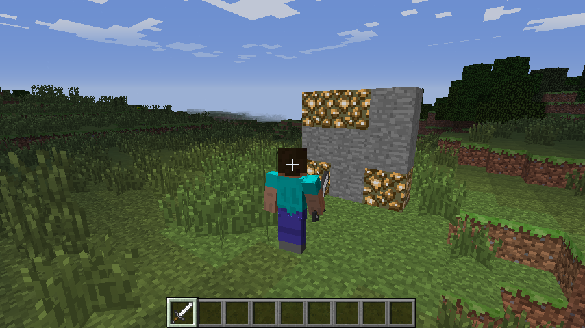
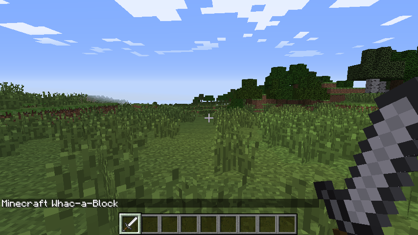
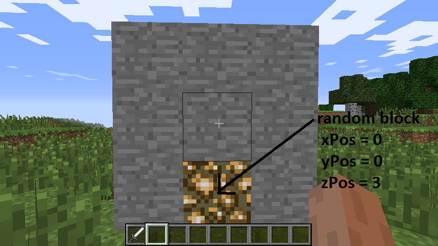
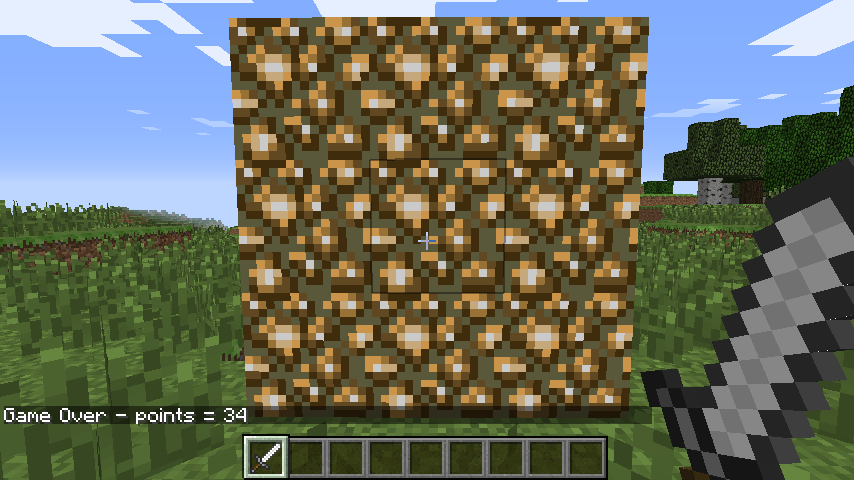

# Making a game with Minecraft Pi

Minecraft is a popular sandbox open world-building game. A free version of Minecraft is available for the Raspberry Pi; it also comes with a programming interface. This means you can write commands and scripts in Python code to build things in the game automatically. It's a great way to learn Python!  

If you have already completed ["Getting Started With Programming The Minecraft World"](http://www.raspberrypi.org/learning/getting-started-with-minecraft-pi/) and want to do more, how about creating your own game in Minecraft, a "game in a game"!


## Whac-a-Block

The game you are going to create is called "Whac-a-Block", inspired by the original arcade game ["Whac-a-Mole"](http://en.wikipedia.org/wiki/Whac-A-Mole), the objective of the game is to whack (or hit with a sword) the blocks that light up as glowstone and turn them back to stone. You will earn points for each block you turn back to stone and the game is over when all the blocks have been turned into glowstone.



This project has been split into 5 parts:

1. Create the program - starting your Minecraft Python program and making sure everything is working
2. Build the game board - creating the code which will make game board appear in front of the player
3. Turn the blocks on - coding the functions to turn the blocks randomly into glowstone
4. Whac blocks - turn the blocks back to stone when the player hits then
5. Game over - the game is over, how many points did you score.

### Create the program

Open IDLE (not IDLE3) by using the icon on the desktop.

When the Python Shell appears, create a new program using `File > New Window`. You may also want to save your program now using `File > Save`.

Import the python modules you are going to need for this program:
- mcpi.minecraft - needed to interact with Minecraft: Pi Edition
- mcpi.block - needed to work with Minecraft blocks
- random - used to create random numbers
- time - used to put delay into your program

```python
import mcpi.minecraft as minecraft
import mcpi.block as block
import random
import time
```

Create a connection to Minecraft: Pi Edition and post a message to the chat window

```python
mc = minecraft.Minecraft.create()
mc.postToChat("Minecraft Whac-a-Block")
```

You can run the program now, it wont do a much, but if everything is setup correctly you should see "Minecraft Whac-a-Mole" displayed in the minecraft chat window.

If you haven't done so already, startup Minecraft and create/open a world.
Run your program by clicking `Run > Run Module` in IDLE or pressing F5.
Any errors will appear in red in the Python Shell window.



### Build the game board

The next step is to create the game board, 3x3 stone blocks, which will turn randomly turn into glowstone and light up.

The game board will be created just in front of the player, so the first step is to get the players position using player.getTilePos().  

```python
pos = mc.player.getTilePos()
```

The players position is then used with the setBlocks() function to create the game board out of stone.


```python
mc.setBlocks(pos.x - 1, pos.y, pos.z + 3,
             pos.x + 1, pos.y + 2, pos.z + 3,
             block.STONE.id)
```

To give the player a warning that the game is a about to start, post a couple of messages to the chat window and put a delay into the program using `time.sleep(seconds)`.

```python
mc.postToChat("Get ready ...")
time.sleep(2)
mc.postToChat("Go")
```

Run the program again you should see the game board appear directly infront of the player and the messages "Get ready ..." and "Go".

### Turn the blocks on

Next you are going to create the code which will turn the stone blocks to glowstone (and light them up). The blocks will turn on randomly and you will use the ```random.randint(start, end)``` function to pick the random block on the game board.

Create a variable called `blocksLit` which will hold the number of blocks which are currently lit (i.e. turned into glowstone) and a variable called `points` which will hold how many points the player has scored.  As its the start of the game set them both to 0.

```python
blocksLit = 0
points = 0
```

Your program will need to loop until its game over, or in this case, until all the blocks are lit.

Create a while loop which will continue until the 'blocksLit' variable is 9 (i.e. all the blocks have been turned to glowstone) and put a small delay into the program (0.2 seconds), otherwise the program will run so fast you wont be able to whac any blocks!

```python
while blocksLit < 9:
    time.sleep(0.2)
```

From this point the code will be indented under this while loop.

The next step is to randomly turn a block into glowstone. This is more difficult than it sounds because what happens if the block you randomly choose is already glowstone?  Your code needs to be able to deal with this. 

The method you will use is a really simple one; the code creates a random position, it will check to see if that block is stone, if it isn't (i.e. its glowstone), it will try again and create a new random position - it will continue to do this until it finds a block which is still unlit.

Create a variable called `lightCreated`, set it to `False` and create a while loop which will continue until `lightCreated` is set to `True`.  You should also increase the number of blocksLit by 1, to show that another block will be lit.

```python
    blocksLit = blocksLit + 1
    lightCreated = False
    while not lightCreated:
```

Once a block has been successfully turned to glowstone, `lightCreated` will be set to `True` and the loop will exit. 

Inside this loop use ```random.randint(start, end)``` to create a random x (between -1 and 1) and y (between 0 and 2) position on the game board.  

```python
        xPos = pos.x + random.randint(-1,1)
        yPos = pos.y + random.randint(0,2)
        zPos = pos.z + 3
```



Use `getBlocks(x,y,z)` and an `if` statement to check to see if the block at the random position is STONE, if it is, set it to glowstone using setBlocks(x,y,z,blockId) and make `lightCreated = True`, otherwise the code will go back to the start of the loop and find another random position.

```python
        if mc.getBlock(xPos, yPos, zPos) == block.STONE.id:
            mc.setBlock(xPos, yPos, zPos, block.GLOWSTONE_BLOCK.id)
            lightCreated = True
```

Note - Rather than using the id numbers of blocks (e.g. stone = 1, glowstone = 89) you can use the block module, which holds all the blocks id's and their names (e.g. block.STONE.id).

Run the program, by click `Run > Run Module` in IDLE or pressing F5, you should see the game board appear, the stone blocks should then 1 by 1 turn into glowstone and the program should end when all 9 have been lit.

### Whac blocks
The player will whac blocks by hitting them (right clicking) while holding a sword.  The Minecraft API has functions which allow you to find out what blocks have been hit, these are known as block hit *events* and using the function `events.pollBlockHits()` you can get a list from Minecraft of the events that have occured (i.e. blocks which have been hit) since it was last called.

You will use events to find out the position of the block which has been hit, before using `getBlock(x,y,z)` to see if the block hit was glowstone, if it was you will then use `setBlock(x,y,z,blockId)` to turn it back to stone, reduce the number of blocks lit by 1 and increase the player's score.

Indented under the `while blocksLit < 9` loop, create the following code to loop through the block hit events list.

```python
    for hitBlock in mc.events.pollBlockHits():
```

Note - The hitBlock variable holds the *event* which has happened and it contains lots of information including which block was hit, what face was hit and who hit it, you can see the information in the Python Shell by using `print hitBlock`.

Use `getBlock(x,y,z)`, the `hitBlock` event data and an `if` statement to see if the block hit was glowstone.  If it was, use `setBlock(x,y,z,blockId)` to set it back to stone, minus 1 from the `blocksLit` variable and add 1 to the `points` variable.

        if mc.getBlock(hitBlock.pos.x, hitBlock.pos.y, hitBlock.pos.z) == block.GLOWSTONE_BLOCK.id:
            mc.setBlock(hitBlock.pos.x, hitBlock.pos.y, hitBlock.pos.z, block.STONE.id)
            blocksLit = blocksLit - 1
            points = points + 1 

Run the program, the game board should appear and this time when the blocks are lit, if you hit them (right clicking with a sword) they should turn off.

### Game over

The last step in the game is to let the player know its "Game Over" and to tell them how many points they scored.  The very last line of the program should be.

```python
mc.postToChat("Game Over - points = " + str(points))
```



### Stretch - Adding Game Play!

This might be the end of this worksheet, but it doesn't have to be for this game.  At the moment the game play is pretty basic, there is a lot you can do now you have the basic program setup to make it your own.  Here are some idea's to get your started.

The difficulty of the game is set by the how long the program waits before lighting another block, `time.sleep(0.2)`, by increasing this time you make the change easier, decreasing it you make the game harder.  Experiment and see what works best for you.

What about if the player gets things wrong and hits a stone block instead of a glowstone block?  Can you change the program so that if the player hits a stone block it lights the block?  This would make the player have to think more about what block they are hitting and increase the skill required.

It is usual in video games for them to start easier and get harder, can you make the game start easier and the more points you score the harder it gets?

## API reference

For a more extensive documentation of functions and a full list of block IDs see an API reference at [stuffaboutcode.com](http://www.stuffaboutcode.com/p/minecraft-api-reference.html).